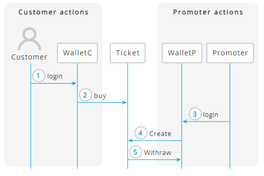

Análisis funcional

Documento Diseño y Análisis Funcional

BLOCKTICK

HOJA DE CONTROL

|**Proyecto**|Proyecto|||
| :- | :- | :- | :- |
|**Entregable**|Documento diseño y análisis funcional|||
|**Autor**|[Compañía]|||
|**Versión/Edición**|0100|**Fecha Versión**|01/03/2023|
|**Aprobado por**||**Fecha Aprobación**|DD/MM/AAAA|
|||**Nº Total de Páginas**|X|

REGISTRO DE CAMBIOS

|**Versión**|**Motivo del Cambio**|**Responsable del Cambio**|**Fecha**|
| :- | :- | :- | :- |
|**001**|Versión inicial|Ana Ndongo|01/03/2023|
|||||

# Contenido
[1	Introducción	3](#_toc132831724)

[1.1	Objetivos	3](#_toc132831725)

[2	Especificación de Casos de uso del Sistema	4](#_toc132831726)

[2.1	Actores del sistema	4](#_toc132831727)

[2.2	Listado Casos de uso del Sistema	4](#_toc132831728)

[2.3	Diagrama UML	4](#_toc132831729)

[2.4	Diagrama de secuencia	5](#_toc132831730)

[2.5	Interfaces y pantallas	7](#_toc132831731)

[3	Detalle Casos de uso del Sistema	9](#_toc132831732)

[4	Entidades del sistema	10](#_toc132831733)

[4.1	Descripción entidades del sistema	10](#_toc132831734)

[5	Definición de Smart Contracts	12](#_toc132831735)

1  # **Introducción**
El presente proyecto presenta una plataforma web en el que las propietarias de salas o grupos que hagan bolos en estas salas puedan promocionar sus bolos, de esta plataforma se excluyen cualquier otro recinto que no sea una sala de conciertos.

La tecnología de blockchain presenta la ventaja de ser una plataforma que puede acabar con la reventa en el caso de grandes eventos, pero este proyecto pretende dar la oportunidad a pequeños eventos en los que las personas puedan interactuar directamente con el promotor de dicho evento sin necesidad de intermediarios que puedan encarecer el servicio ofrecido.

1  ## ***Objetivos***

La dAPP descrita a continuación será una plataforma donde las personas usuarias interesadas podrán crear eventos y poner a la venta tickets (NFT) que podrán ser vendidos/intercambios en dicha plataforma a otros usuarios interesados en la asistencia a dicho evento

Página 13 de 13

` `Documento diseño y análisis funcional - Proyecto 
1  # **Especificación de Casos de uso del Sistema**
   1  ## ***Actores del sistema***
Definición de usuarios (o perfiles de usuario) que interactuarán en el sistema

|**1**|*Nombre Rol*|
| :- | :- |
|**Descripción**|Usuario interesado – promotora de conciertos en salas exclusivamente (**promoter**)|
|**Comentarios**|
*Persona física o jurídica que promueve un evento o espectáculo y lo publicita* 

*Para venta de entrada dentro de la plataforma*

|

|**2**|*Nombre Rol*|
| :- | :- |
|**Descripción**|Usuario interesado – persona asistente al evento (**customer**)|
|**Comentarios**|*Persona física que quiere asistir a un evento musical*|

1  ## ***Listado Casos de uso del Sistema***

|**Código**|**Descripción**|**Prioridad**|**Dependencia**|
| :- | :- | :- | :- |
|CU1|*Customer Login to wallet*|1||
||*Buy tickets*|||
||*Create Events*|||
||*Consult events*|||
|||||

1  ## ***Diagrama UML***

1  ## ***Diagrama de secuencia***

1  ## ***Interfaces y pantallas***

**Landing Page**

**Ticket page**

**Event Page**

**Create Form**

1  # **Detalle Casos de uso del Sistema**

|**CU1**|*Nombre caso de uso*|
| :- | :- |
|**Descripción**||
|**Pantalla**||
|**Rol**||
|**Flujo**||
|**Flujo alternativo**||

1  # **Entidades del sistema** 
   1  ## ***Descripción entidades del sistema***

|**1**|*Nombre entidad*|
| :- | :- |
|**Descripción**||
|**Atributos**||
|**Acciones**||
Diagrama Entidad Relación E/R

**Hacer diagrama con Visual Paradigm (plantilla CLASS: <https://online.visual-paradigm.com/app/diagrams/#diagram:proj=0&type=ClassDiagram&width=11&height=8.5&unit=inch>**)

1  # **Definición de Smart Contracts**

**Descripción entidades del sistema: cada una de las partes del smartContract**

|
**Nombre SC:   BlockTick**

*Nombre entidad*
||||
| :- | :- | :- | :- |
|***atributo***|***Tipo de dato***|***descripción***||
|**ticketPrice**|*uint256*|*Define el valor del ticket*||
|**owner**|*address*|*Define la dirección del creador del contrato*||
|**ticketHolder**|*Uint256*|*Estructura de datos de tipo mapping*||
|**Nombre función**|***Parámetro entrada***|***Parámetro salida***|***Descripción***|
|**constructor**||*owner*|*El propietario del contrato es el creador del mismo*|
|**buyTickets**|*\_user, \_amount*|*\_user, \_amount*|*Requiere que el valor final sea múltiplo del valor del ticket \* su cantidad*|
|**useTickets**|*\_user, \_amount*|*\_user, \_amount*|*Describe la cantidad de tickets usados por usuario*|
|**addTickets**|*\_user, \_amount*|*\_user, \_amount*|*Transfiere tickets a cualquier address y la cantidad*|
|**subTickets**|*\_user, \_amount*|*\_user, \_amount*|*Verifica la cantidad de tickets que tienes disponible para gastar*|
|**withraw**|*N/A*||*Recupera la cantidad de tickets vendidos al owner definido en el constructor*|
|**Relación con otros SC**|**BlockTickAsset**|||
|**observaciones**||||

|
**Nombre SC: BlockTickAsset**

*Nombre entidad*
||||
| :- | :- | :- | :- |
|***atributo***|***Tipo de dato***|***descripción***||
|**eventName**|*string*|*Describe el título del evento y es de tipo público*||
|**eventPromoter**|*string*|*Describe el nombre de la promotora del evento y es de tipo público*||
|**owner**|*address*|*Describe el propietario del contrato creador del contrato (Contract Factory)*||
|**price**|*uint*|*Describe el precio de asistencia al evento y es de tipo público*||
|**Nombre función**|***Parámetro entrada***|***Parámetro salida***|***Descripción***|
|**constructor**|
*\_eventName, \_eventPromoter, \_owner,* 

*\_price*
|||
|**buyTicket**|*N/A*||*Requiere que el precio se igual al creado  en el contrat, una función de tipo “payable”, que tranfiere del* |
|**getPrice**|*N/A*|*price*||
|**Relación con otros SC**|**BlockTick**|||
|**observaciones**|Este es un Contract Factory|||

